# Quest 2 - Create a first ChatBot

[ < Quest 1 ](quest1.md) - **[ Quest 3 > ](quest3.md)**

With this first experience, of what is possible with GPT, lets create a first chatbot that allows you to interact with a public webpage

* Open the [Microsoft Copilot Studio](https://copilotstudio.microsoft.com/) and log in with your Microsoft Work or School account (**not** @outlook.com, @live.com). 
> [!NOTE]
> If you do not have a Microsoft Work or School account yet, sign-up for the [M365 Developer Program](https://developer.microsoft.com/en-us/microsoft-365/dev-program)
> For the DSAGTechXChange Hands on, we will provide a username to you

> [!NOTE]
> For participants in the DSAG TechXChange please use the following user assigned to you
> | DSAG User | Copilot Studio User |
> |--------------|-----------|
> |User 1|alans@CRM625261.OnMicrosoft.com	|
> |User 2|aliciat@CRM625261.OnMicrosoft.com|	
> |User 3|allieb@CRM625261.OnMicrosoft.com|	
> |User 4|amya@CRM625261.OnMicrosoft.com	|
> |User 5|annew@CRM625261.OnMicrosoft.com	|
> |User 6|carlosg@CRM625261.OnMicrosoft.com	|
> |User 7|christag@CRM625261.OnMicrosoft.com|	
> |User 8|danj@CRM625261.OnMicrosoft.com	|
> |User 9|davids@CRM625261.OnMicrosoft.com	|
> |User 10|dianep@CRM625261.OnMicrosoft.com|	
> |User 11|ericg@CRM625261.OnMicrosoft.com	|
> |User 12|gregw@CRM625261.OnMicrosoft.com	|
> |User 13|jamier@CRM625261.OnMicrosoft.com|	
> |User 14|jeffh@CRM625261.OnMicrosoft.com	|
> |User 15|juliani@CRM625261.OnMicrosoft.com|	
> |User 16|karenb@CRM625261.OnMicrosoft.com|	
> |User 17|kellyk@CRM625261.OnMicrosoft.com|	
> |User 18|mollyc@CRM625261.OnMicrosoft.com|	
> |User 19|reneel@CRM625261.OnMicrosoft.com|	
> |User 20|sanjays@CRM625261.OnMicrosoft.com	|
> |User 21|spencerl@CRM625261.OnMicrosoft.com|	
> |User 22|svenm@CRM625261.OnMicrosoft.com	|
> |User 23|veronicaq@CRM625261.OnMicrosoft.com|	
> |User 24|williamc@CRM625261.OnMicrosoft.com|	
> |---|- Careful, the Domain is changed for the next ones! - |
> |User 25|jeffh@CRM433983.onmicrosoft.com|	
> |User 26|juliani@CRM433983.onmicrosoft.com|	
> |User 27|karenb@CRM433983.onmicrosoft.com|	
> |User 28|kellyk@CRM433983.onmicrosoft.com|	
> |User 29|gregw@CRM433983.onmicrosoft.com|	
> |User 30|ericg@CRM433983.onmicrosoft.com|

* Enter the `Microsoft Corp / Work Email Address`

* Provide your `password`

* If required click on `Ask Later to skip` the additional authentication steps
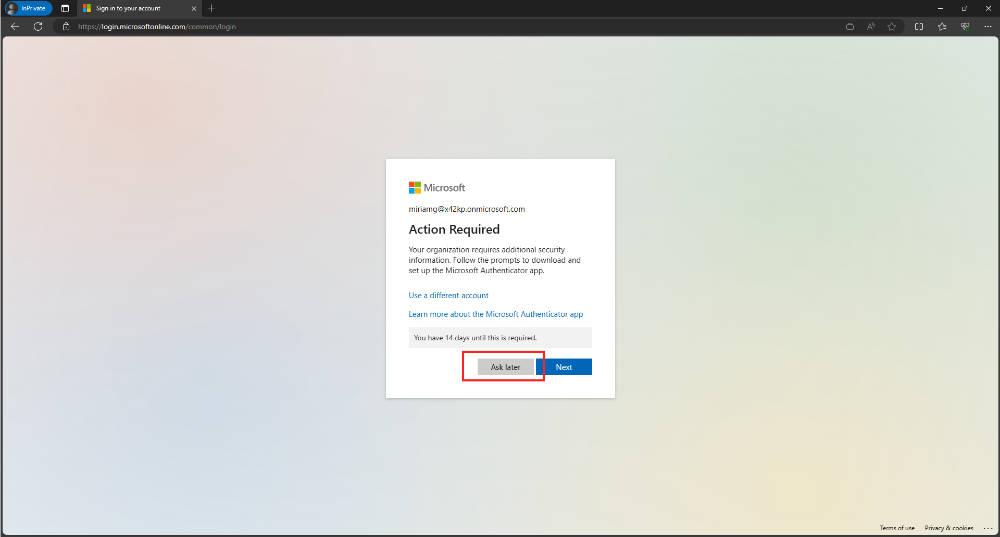

* Select `Stay signed in`

* Click on `Start Free Trial`
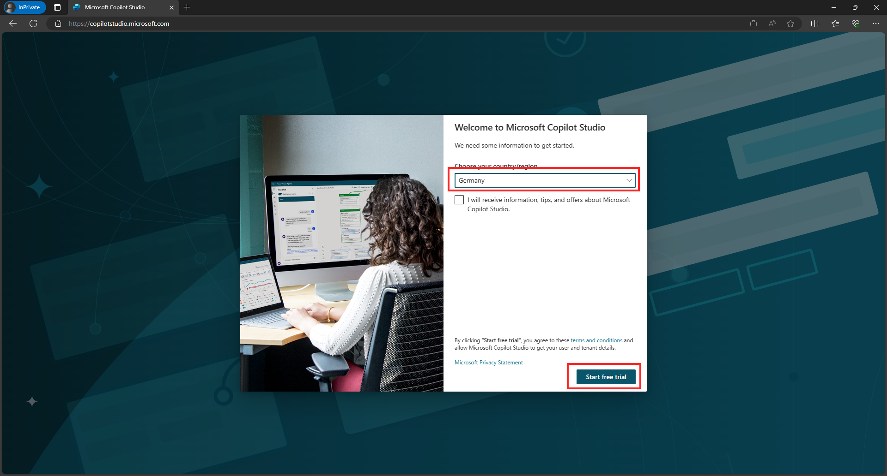

* Microsoft Copilot Studio is an evolution of Power Virtual Agent. Click on `Done` 

* From `Home` Click on `+ Create a new Copilot` 

* Provide the required input parameters, e.g. 

- a name for the new Copilot, e.g. `CSU Airlift Copilot`
- Select a language, e.g. `German`
- enter a URL to the root webiste that you want to query, e.g. `https://learn.microsoft.com/`
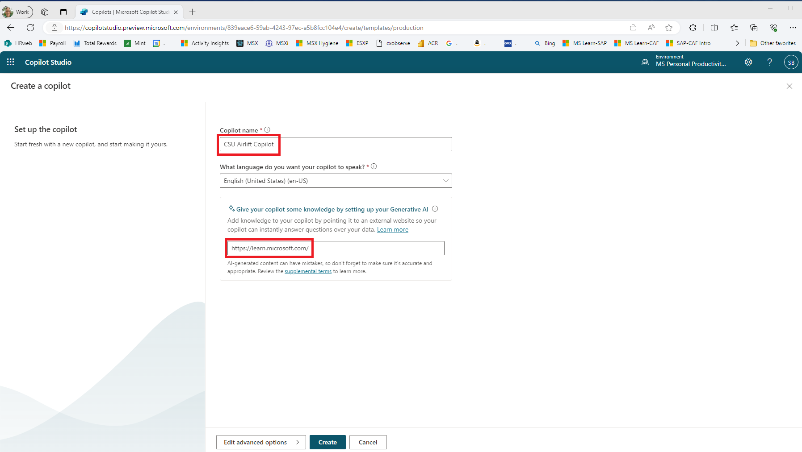

* Then click on `Create`

* It might take a few minutes, but then you should see a screen like this:
* Click on `Skip`

* on the Left hand side you can already start testing the copilot. Enter a Question like: `What can you tell me about SAP on Azure?`
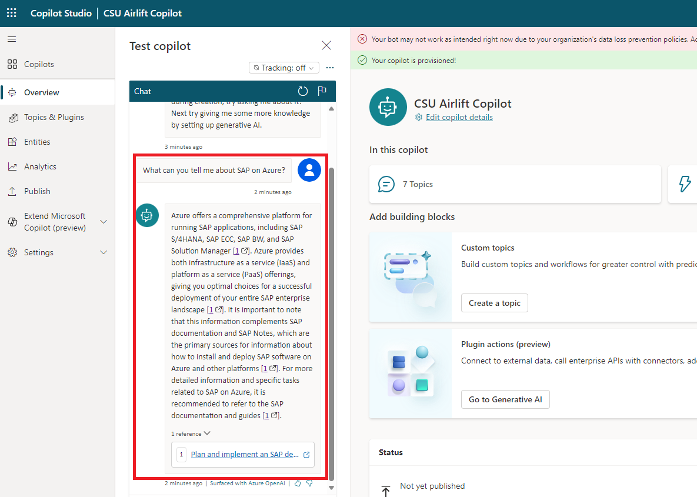

You should see a result with references to the learn.microsoft.com. 

* In order to better understand, what was happening, `switch on Tracing`, `Restart the session` and ask another question, e.g. `What are the Microsoft storage recommendations for an SAP system?`

* On the right hand side, you can see that an `On Unkonwn Intent` trigger was used. Then the question was passed into the `Create generative answers` action and a result -- coming from a `public  website (1)` data source was used. 
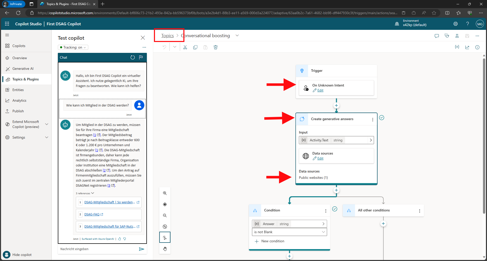

* Click on `Topics` to navigate to the `Topics` that are definied by default. 

* Click on `Greetings` to see the Trigger phrases, that start this specific flow:
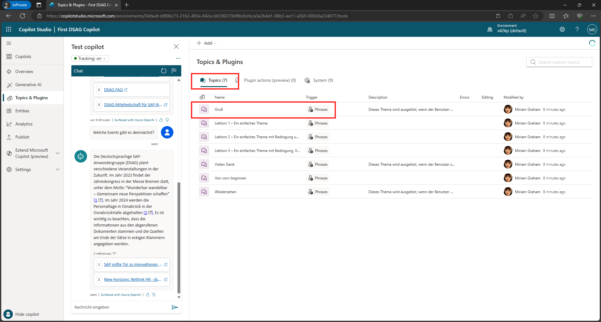

* Give it a try and enter one of these phrases to see this Trigger being executed
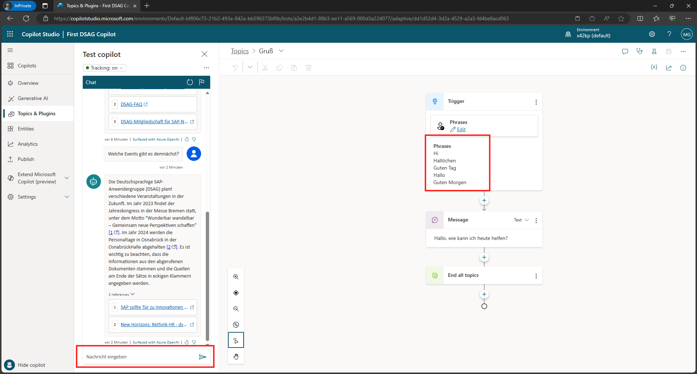

* Notice that even if you enter another phrase (Good Morning / Good Afternoon), the trigger is still executed:

* However, when you enter something else (e.g. we are in Munich, so I would expect `Servus` or `Griaßdi`) to work as well, we are redirected to the `On Unknown Intent` trigger. 
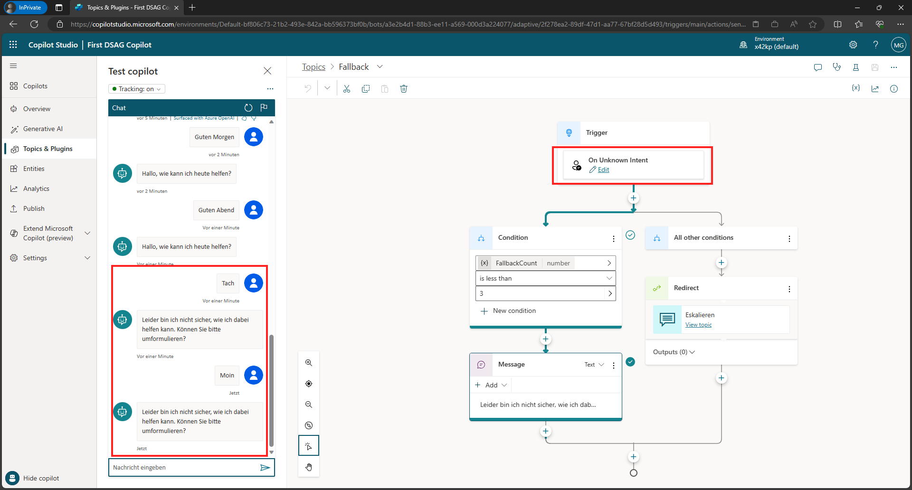

* Click on `Topics`, and `Greetings` to go back to the Greetings trigger. 

* Click on the `Edit` link and add additional phrases, like `Servus`, `Griaßdi`, 

* Click on `Save` again, `restart the converstion` and try again with a phrase that previously did not work. 

* Now the correct trigger should be started. 

* Before we publish this first version to a demo website, lets add the Icon that we had created in the previous step. 
Go to `Settings` and select `Copilot Details`.
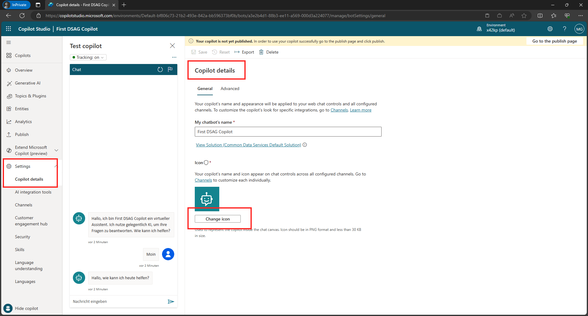

* Here you can change the Name of the Chatbot, but more importantly also change the `icon`. Click on the `Change Icon` and upload the icon you previously created with Microsoft Designer- Then click on `Save`

* Before publishing the bot, it is good to setup authentication. Navigate to `Settings` -> `Security` and select `Authentications`. Access from Teams and Power Apps is already protected via Azure Active Directory / Entra-ID. For our demo, we will switch the authentication to `No authentication` so we can easily access the bot from a demo website without the need to configure this new site with Entra-ID authentication. 

Note: You could configure AAD or any other Oauth2 identity provider (like the SAP BTP Identity Authentication service) from here

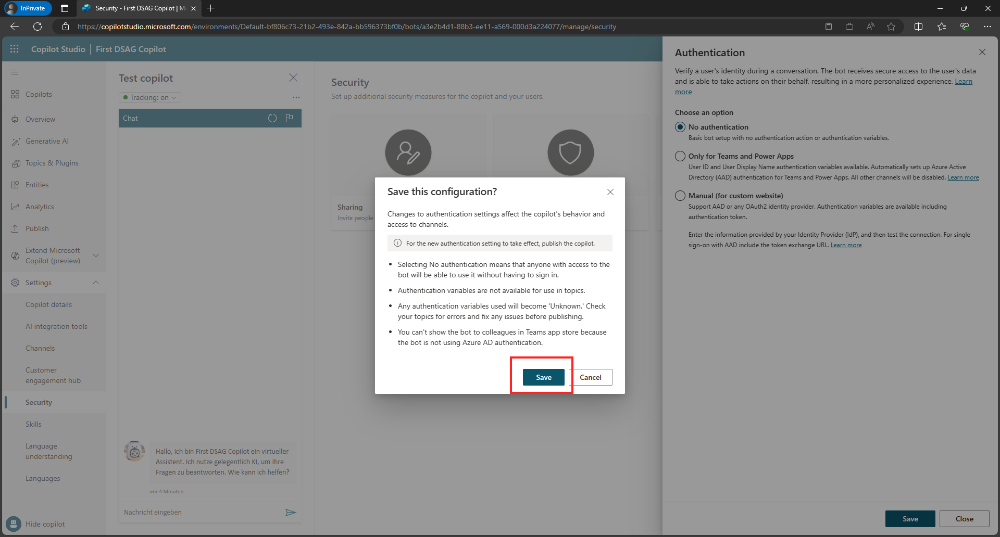

* Click on `Close`

* Navigate to `Publish` and click on `Publish`
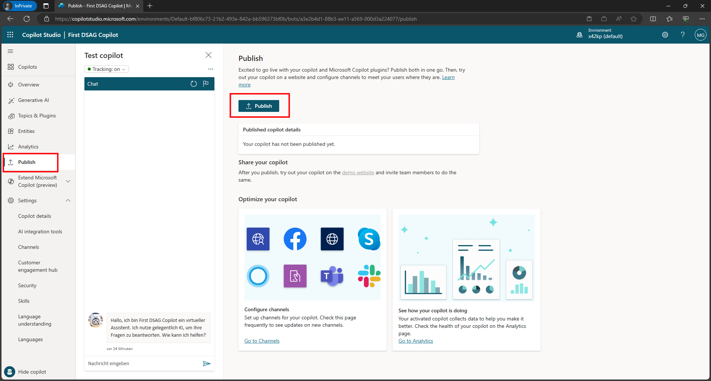

* Confirm the `Publish` latest content

* After a few minutes you should get the confirmation that the copilot was published. Now click on `Go to Channels`

* And click on `Demo website`

* Click on `Copy` to get the URL of the new Webiste and open it in a new browser. 

* We now have a working Chatbot that works with data from a website that you specified. In addition to this demo website, this Chatbot could be exposed to Teams or also embedded within a SAP Fiori Launchpad. 

## Where to next?
[ < Quest 1 ](quest1.md) - **[ Quest 3 > ](quest3.md)**

[🔝](#)
